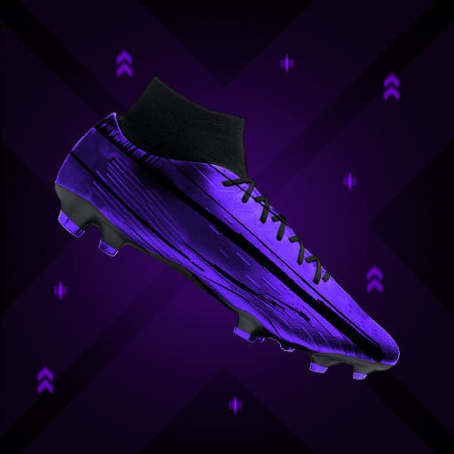

# Sphera
## Table of Contents
-[About](#about)
    -[NFTs](#nfts)
        -[Layers](#layers)
        -[Rarities](#rarities)
        -[Attributes](#attributes)
-[Installation](#installation)
-[Usage](#usage)
-[Features](#features)
-[License](#license)

## About
Sphera is an ERC-1155 NFT collection where each NFT is linked to the performance of a real football player. Mint your Sphera boots and watch its stats grow as the linked player plays more and more matches!

### NFTs
#### Layers

Above is an example image of an NFT in the collection. Each NFT contains **_4 different layers_** being:

- Background
- Boot
- Design
- Stud

#### Rarities
Each of the layers looks different based on its rarity. The possible rarities are:

- Common (green)
- Rare (blue)
- Epic (purple)
- Legendary (red)

The `Background`, `Boot` and `Stud` are all coloured according to their rarities however the design on the boot varies.

**_NOTE : Common boot designs are blank_**

|Rarity                     |   Boot Design             |
:--------------------------:|:--------------------------:
Rare                        |   
Epic                        |    
Legendary                   |   

#### Attributes
Each NFT also contains the following attributes:

- Attacking
- Midfielding
- Defending

The attributes are all initialised to 50, with the rarity of each layer of the NFTs also providing a _boost_ to each attribute which are as follows:

- Common: `+0`
- Rare: `+1`
- Epic: `+3`
- Legendary: `+5`

Each NFT is linked to a player from the squad of any English Premier League team (as of the 24/25 season), and after everyday the performance of every player is analysed and corresponding NFTs _attacking, midfielding_ and _defending_ stats are updated. Stats are influenced based on the position of the linked player with:

|Position                   |   Stats Influence             |
:--------------------------:|:------------------------------|
Forward                     |   Goals, assists, shots and dribbles
Midfielder                  |   Goals, assists, passing accuracy and dribbles
Defender                    |   Tackles, interceptions and blocks
Goalkeeper                  |   Saves, goals conceded and clean sheets

## Installation
TO-DO

## Usage
TO-DO

## Features
TO-DO

## License
See [LICENSE](LICENSE)
